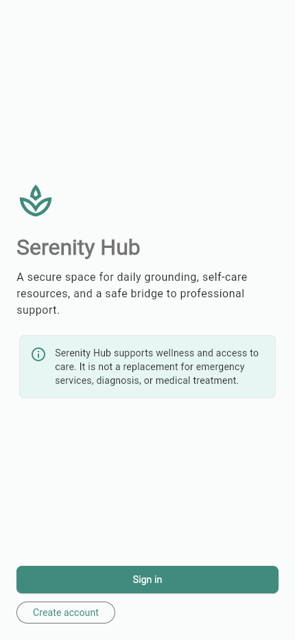
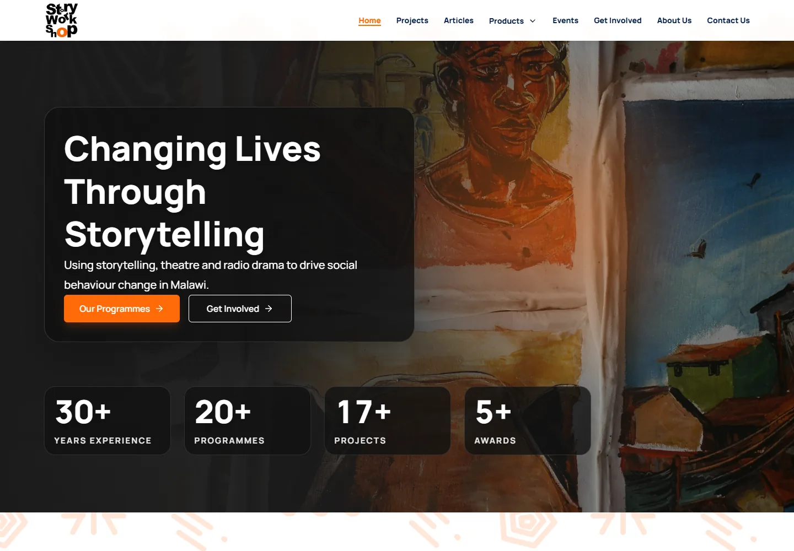
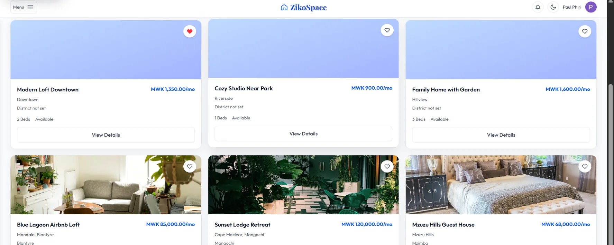
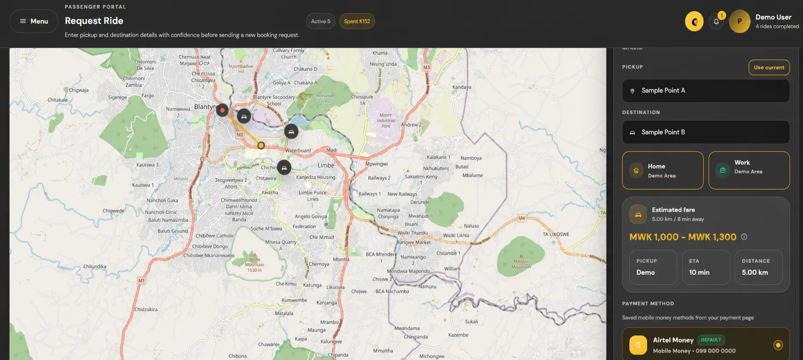
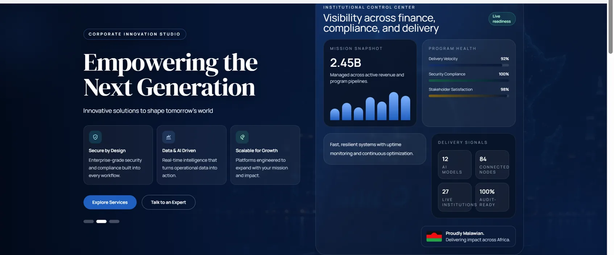

# Paul Napoleon Phiri — Software Developer Portfolio

A responsive portfolio presenting my work across full-stack web development,
mobile applications, APIs, payment integrations, and operational software.

Built with Next.js, React, and TypeScript, the site includes selected case
studies, professional experience, technical skills, engagement options, and a
downloadable résumé.

[LinkedIn](https://linkedin.com/in/paul-phiri-2574281b0) ·
[GitHub](https://github.com/MustbePaul) ·
[Résumé](public/resume.pdf) ·
[Email](mailto:phiri6paul@gmail.com)

## Portfolio highlights

- Five selected projects with clear ownership and contribution attribution
- Responsive, accessible interface with reduced-motion support
- Data-driven project, experience, qualification, and skills content
- Client-side contact validation using React Hook Form and Zod
- Static rendering with canonical, Open Graph, robots, sitemap, and structured metadata
- Automated formatting, linting, type checking, and production build commands

## Selected projects

### Serenity Hub — Personal Project



A Flutter mental-wellness application backed by a Laravel API. I built the
mobile experience and API workflows for authentication, guided media,
progress tracking, therapist discovery, booking, mood check-ins, bookmarks,
and support requests.

- **Stack:** Flutter, Laravel 13, PHP 8.3, Provider, SQLite, REST API
- **Source:** [MustbePaul/Serenity-Hub](https://github.com/MustbePaul/Serenity-Hub)

### Story Workshop Website — Client Project



Contributed to Story Workshop's public storytelling platform and protected CMS
for articles, events, vacancies, bookings, newsletters, and submissions.

**Stack:** React 19, Laravel 13, Sanctum, MySQL, React Query, Framer Motion

### ZikoSpace — Terex Innovation Lab In-House Project



As a Terex Innovation Lab developer, rebuilt authentication and routing,
corrected persistent theming, and delivered accommodation-booking workflows.

**Stack:** Laravel, PHP, JavaScript, MySQL, Tailwind CSS

### TaxiHire / SWIFTR — Terex Innovation Lab In-House Project



Contributed passenger, driver, and administrator experiences plus PayChangu and
OneKhusa payment integrations as part of the Terex Innovation Lab team.

**Stack:** Flutter, Angular, Node.js, PayChangu, OneKhusa

### Terex Website Redesign — Terex Innovation Lab In-House Project



Contributed refreshed hero, partner, and initiative content with responsive
layouts and purposeful scroll interactions. The redesign is **under review and
not yet in production**; the existing Terex website remains the production site.

**Stack:** React, JavaScript, CSS

## Technology

| Area        | Tools                                              |
| ----------- | -------------------------------------------------- |
| Application | Next.js 16, React 19, TypeScript                   |
| Interface   | CSS, Framer Motion, Lucide React                   |
| Forms       | React Hook Form, Zod                               |
| Quality     | ESLint, Prettier, TypeScript                       |
| Deployment  | Static Next.js output on a Node.js-compatible host |

## Project structure

```text
app/                 Routes, metadata, sitemap, robots, and global styles
components/          Portfolio interface and client-side interactions
data/                Typed portfolio content
public/images/       Portrait and project previews
public/resume.pdf    Downloadable résumé
resume/              Résumé source and GitHub profile copy
```

Routine portfolio content changes belong in `data/portfolio.ts`. UI behavior
belongs in `components/Portfolio.tsx`.

## Run locally

Requirements: Node.js 20.9 or later and npm.

```bash
npm install
cp .env.example .env
npm run dev
```

On Windows PowerShell, replace the copy command with:

```powershell
Copy-Item .env.example .env
```

Open [http://localhost:3000](http://localhost:3000).

## Quality checks

```bash
npm run format:check
npm run lint
npm run typecheck
npm run build
npm run test:e2e
npm run lighthouse
npm audit --omit=dev
```

The portfolio pages are statically rendered. Contact delivery uses a Next.js
route handler and Resend; no database is required.

## Deployment configuration

Import the repository into Vercel. If the repository contains a parent folder,
set the Vercel root directory to `portfolio`. The first Vercel build can use
Vercel's automatically supplied production hostname. Once Vercel assigns the
permanent `*.vercel.app` URL, add it to all production environments and
redeploy:

```env
NEXT_PUBLIC_SITE_URL=https://your-project.vercel.app
RESEND_API_KEY=re_your_api_key
CONTACT_TO_EMAIL=phiri6paul@gmail.com
CONTACT_FROM_EMAIL=Portfolio <hello@your-verified-sending-domain.example>
```

`NEXT_PUBLIC_SITE_URL` drives canonical, Open Graph, Twitter, structured-data,
robots, and sitemap URLs. It must be an HTTPS origin without a path. A future
custom domain only requires changing this environment variable and redeploying.

`RESEND_API_KEY` is server-only. Verify the domain used by
`CONTACT_FROM_EMAIL` in Resend before enabling production delivery. Until all
three contact variables are configured, the API intentionally responds with
HTTP 503 and the interface offers direct email and WhatsApp alternatives.

## Ownership and reuse

Serenity Hub is my personal project. Story Workshop is a client project.
ZikoSpace, TaxiHire/SWIFTR, and the Terex website redesign belong to Terex
Innovation Lab and are presented to document my professional contributions.

This repository is intentionally unlicensed. Public visibility does not grant
permission to reuse client/employer branding, screenshots, artwork, interfaces,
or other intellectual property. See [ASSET_RIGHTS.md](ASSET_RIGHTS.md).
